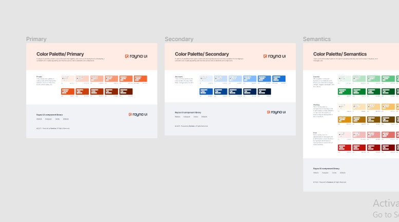
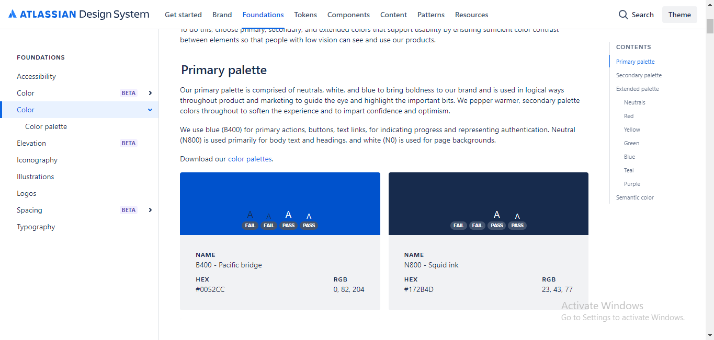
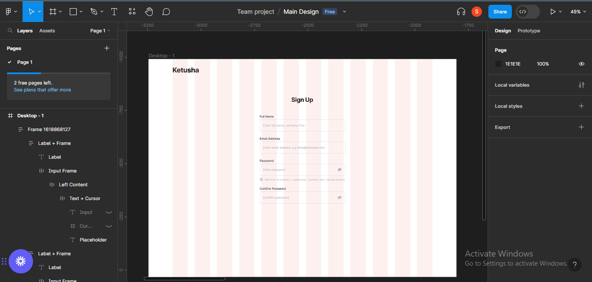

# Cách sử dụng hệ thống thiết kế – một nghiên cứu điển hình

#### Bạn có thể đã nghe nói, nghiên cứu hoặc sử dụng một hệ thống thiết kế tại một thời điểm nào đó trong sự nghiệp viết mã của mình. Nhưng hệ thống thiết kế thực sự đóng vai trò gì trong các dự án của chúng ta? Tại sao chúng ta lại phải bận tâm đến việc tạo ra hoặc sử dụng chúng?

Trong hướng dẫn này, bạn sẽ tìm hiểu hệ thống thiết kế là gì, tại sao chúng quan trọng, các yếu tố điển hình của hệ thống thiết kế và ví dụ thực tế về cách triển khai hệ thống thiết kế với tư cách là nhà thiết kế. Hãy đi sâu vào!

## Hệ thống thiết kế là gì?

Hệ thống thiết kế là tập hợp có cấu trúc của các thành phần và phần tử thiết kế có thể tái sử dụng. Chúng tôi sử dụng chúng để tạo ra trải nghiệm người dùng nhất quán và gắn kết trên nhiều sản phẩm hoặc dịch vụ.

Hệ thống thiết kế giống như một tập hợp các khối và quy tắc xây dựng để tạo ra các sản phẩm kỹ thuật số như trang web và ứng dụng. Hệ thống thiết kế được tạo thành từ các yếu tố chính như kiểu chữ, bảng màu, biểu tượng, khoảng cách và bố cục, v.v.

### Tầm quan trọng và mục đích của Hệ thống thiết kế

Hệ thống thiết kế rất quan trọng vì nhiều lý do.

### Hiệu quả

Hệ thống thiết kế giúp bạn trở nên hiệu quả hơn. Bởi vì nó là tập hợp các thành phần có thể tái sử dụng nên nó tiết kiệm thời gian tạo ra các thành phần mới và giúp các nhà thiết kế tạo ra các tính năng mới một cách nhanh chóng trong các dự án. Nó cũng phục vụ như một sự tăng cường năng suất.

### Sự hợp tác

Một nhóm đang cố gắng xây dựng một sản phẩm có thể bao gồm các nhà thiết kế, nhà phát triển, người quản lý sản phẩm và những người khác. Hệ thống thiết kế giúp tất cả các thành viên trong nhóm tham khảo các nguyên tắc thương hiệu, bất kể họ làm việc gì. Nó cũng giúp đảm bảo tất cả mọi người, bao gồm cả các bên liên quan, đều tham gia vào quá trình thiết kế và tạo điều kiện cho sự hợp tác.

### Tính nhất quán

Hệ thống thiết kế đảm bảo tính nhất quán trong giao diện người dùng và trải nghiệm người dùng trên nhiều sản phẩm và nền tảng khác nhau.

Chúng ta sẽ không muốn xảy ra tình huống trong đó thiết kế nút không nhất quán trên các màn hình khác nhau, phải không? Đó là lúc hệ thống thiết kế xuất hiện. Nó giúp các nội dung và thành phần thiết kế của chúng ta luôn nhất quán và luôn có thể đóng vai trò là điểm tham chiếu.

### Khả năng mở rộng

Khả năng mở rộng ở đây đề cập đến khả năng hệ thống thiết kế phát triển và thích ứng với nhu cầu thay đổi của một dự án hoặc một tổ chức.

Một yếu tố quan trọng của bất kỳ hệ thống thiết kế nào là khả năng mở rộng. Hệ thống thiết kế sẽ trợ giúp trong các tình huống mà dự án có thể cần mở rộng để phù hợp với các thiết bị và nền tảng khác nhau hoặc khi nhóm đang mở rộng hoặc khi cố gắng đáp ứng các xu hướng và thực tiễn mới.

### Hệ thống thiết kế hoạt động như thế nào

Để hiểu cách hoạt động của một hệ thống thiết kế, bạn chỉ cần biết các loại tài sản hoặc thành phần tạo nên hệ thống và vai trò của chúng.

Một hệ thống thiết kế điển hình bao gồm các phần sau:

### Màu sắc

Khi bạn mở một hệ thống thiết kế, một trong những thứ đầu tiên bạn nhìn thấy là phần bảng màu. Đó là một trong những yếu tố phổ biến nhất trong một hệ thống thiết kế.

Hệ thống thiết kế xác định một tập hợp các màu cơ bản và thứ cấp cũng như các cách sử dụng khác nhau của chúng. Điều này bao gồm màu nền, màu văn bản, v.v.

 Phần bảng màu của hệ thống thiết kế Rayna UI 

 Phần bảng màu của hệ thống thiết kế Atlassian 

### Kiểu chữ

Một yếu tố điển hình khác của hệ thống thiết kế là kiểu chữ. Mọi hệ thống thiết kế thường bao gồm các hướng dẫn về kiểu chữ, chỉ định phông chữ, cỡ chữ, chiều cao dòng, v.v.

Nó cũng có thể xác định cách sử dụng kiểu chữ cho các loại nội dung khác nhau như tiêu đề và nội dung, đảm bảo chúng có thể truy cập và dễ đọc để sử dụng trong thiết kế.

 Phần kiểu chữ trong Material Design của Google 

 Phần kiểu chữ của Polaris của Shopify 

### Icons

Icons rất quan trọng khi cố gắng cung cấp manh mối trực quan cho người dùng của bạn. Hệ thống thiết kế cung cấp một bộ icons và hướng dẫn tiêu chuẩn cho việc sử dụng chúng, đảm bảo chúng dễ nhận biết và nhất quán.

 Phần biểu tượng của hệ thống thiết kế Atlassian 

 Phần biểu tượng trong Material Design của Google 

### Grid và khoảng cách

Hệ thống lưới giúp thiết lập cấu trúc nhất quán cho các thành phần hoặc trang khác nhau.

Hệ thống thiết kế cung cấp các hướng dẫn về khoảng cách, chỉ định lề, phần đệm và các quy tắc khác liên quan đến bố cục để duy trì sự căn chỉnh nhằm tạo ra một thiết kế có tổ chức và đẹp mắt.

 Phần lưới và kiểu khoảng cách của hệ thống thiết kế giao diện người dùng Rayna 

Phần khoảng cách của hệ thống thiết kế Atassian

### Tài liệu

Mọi hệ thống thiết kế có cấu trúc tốt đều có một số dạng tài liệu thường giải thích cách sử dụng các thành phần và hướng dẫn một cách hiệu quả. Tài liệu này cũng giúp các nhà thiết kế và phát triển hiểu cách sử dụng và triển khai hệ thống thiết kế.

Tài liệu về kiểu nút trong hệ thống thiết kế giao diện người dùng Rayna 

 Tài liệu về biểu tượng Ứng dụng trên Nguyên tắc Giao diện Con người của Apple 

### Các mẫu và thành phần giao diện người dùng

Các mẫu và thành phần giao diện người dùng là các khối xây dựng của giao diện người dùng. Hệ thống thiết kế xác định các mẫu và thành phần giao diện người dùng như nút, biểu mẫu, phương thức, đàn xếp, thanh điều hướng, v.v., cùng với hướng dẫn về cách thức và thời điểm sử dụng chúng.

 Phần Thành phần giao diện người dùng của Polaris của Shopify 

 Phần Mẫu giao diện người dùng của Aplles's Human Interface Guidelines 

### Nguyên tắc nội dung

Chúng bao gồm cách sử dụng văn bản và hình ảnh trong giao diện người dùng. Họ có thể chỉ định tông màu, cách sử dụng hình ảnh và phân cấp nội dung, đảm bảo rằng nội dung nhất quán và phù hợp với nguyên tắc thương hiệu.

Phần hướng dẫn nội dung trên Polaris của Shopify

Phần nguyên tắc nội dung trong Material Design của Google

### Nguyên tắc truy cập

Hầu hết các hệ thống thiết kế đều chứa các hướng dẫn về khả năng tiếp cận nhằm tăng khả năng sử dụng sản phẩm cho những người có đủ khả năng. Những nguyên tắc này đảm bảo rằng thiết kế có tính toàn diện và tuân thủ các tiêu chuẩn về khả năng truy cập như WCAG (Web Content Accessibility Guidelines (Nguyên tắc về khả năng truy cập nội dung web)). Điều này bao gồm độ tương phản màu sắc, điều hướng bàn phím và các tính năng trợ năng khác.

Nguyên tắc trợ năng của Material Design của Google

Hướng dẫn tiếp cận của hệ thống thiết kế Atlassian

### Ví dụ và trường hợp sử dụng

Hầu hết các hệ thống thiết kế cũng chứa các ví dụ và trường hợp sử dụng của hệ thống thiết kế đang hoạt động để giúp các nhà thiết kế và nhà phát triển hiểu cách triển khai nó một cách hiệu quả.

Trường hợp sử dụng Bảng điều khiển Fintech từ hệ thống thiết kế giao diện người dùng Rayna

 Áp dụng trường hợp sử dụng loại từ Thiết kế Vật liệu của Google 

## Sự khác biệt giữa Hệ thống thiết kế và Hướng dẫn về phong cách

Hướng dẫn về phong cách và hệ thống thiết kế rất giống nhau và thường có thể bị nhầm lẫn với cùng một thứ – nhưng chúng khác nhau.

Một số khác biệt giữa hệ thống thiết kế và hướng dẫn phong cách là:

### Phạm vi

Hướng dẫn về phong cách có phạm vi tương đối hạn chế và có thể không bao gồm các thành phần hoặc tương tác giao diện người dùng chi tiết.

Mặt khác, hệ thống thiết kế toàn diện hơn và bao gồm nhiều yếu tố hơn bao gồm các thành phần tương tác, hướng dẫn giao diện người dùng, cùng nhiều yếu tố khác.

### Tính nhất quán

Hướng dẫn về phong cách thường tập trung vào việc đảm bảo tính nhất quán của thương hiệu, giúp duy trì giao diện đồng nhất trên nhiều chất liệu và nền tảng khác nhau.

Hệ thống thiết kế nhằm mục đích thiết lập tính nhất quán của cả thương hiệu và giao diện người dùng, bằng cách cung cấp các thành phần có thể tái sử dụng và các mẫu tương tác.

### Sự phát triển và khả năng mở rộng

Hướng dẫn về phong cách có xu hướng phát triển chậm hơn và có thể không có khả năng mở rộng như các hệ thống thiết kế. Hệ thống thiết kế có khả năng thích ứng và phát triển hơn cùng với sản phẩm hoặc dịch vụ.

### Sự hợp tác

Hướng dẫn về phong cách chủ yếu được các nhà thiết kế sử dụng để đảm bảo tính nhất quán về mặt hình ảnh trên toàn bộ thương hiệu. Họ có vai trò hạn chế trong việc tạo điều kiện cho sự hợp tác giữa các nhà thiết kế và nhà phát triển.

Mặt khác, hệ thống thiết kế thúc đẩy sự hợp tác bằng cách cung cấp ngôn ngữ chung và tài nguyên chung giữa nhà thiết kế và nhà phát triển.

### Ví dụ thực tế về hệ thống thiết kế

Rất nhiều tập đoàn phần mềm đã tạo ra hệ thống thiết kế của riêng họ để giúp giảm bớt công việc của các nhà thiết kế và nói chung làm cho trải nghiệm xây dựng sản phẩm trở nên mượt mà hơn.

Ví dụ: Google có một hệ thống thiết kế mà họ sử dụng cho các sản phẩm của mình - bạn có thể thấy các kiểu dáng và thành phần tương tự trong hầu hết các sản phẩm của họ.

Hầu hết các hệ thống thiết kế này đều miễn phí và có sẵn cho công chúng sử dụng. Một số ví dụ về hệ thống thiết kế thực tế là:

- [Google Material Design](https://m3.material.io/) của Google
- [Apple Human Interface Guidelines](https://developer.apple.com/design/human-interface-guidelines) của Apple
- [Atlassian Design System](https://atlassian.design/) của Atlassian
- [Polaris](https://polaris.shopify.com/) của Shopify
- [Carbon Design System ](https://carbondesignsystem.com/) của IBM

## Cách sử dụng hệ thống thiết kế cho thiết kế của bạn - Ví dụ về hệ thống thiết kế giao diện người dùng Rayna

Đối với bài viết này, chúng tôi sẽ sử dụng Hệ thống thiết kế giao diện người dùng Rayna để minh họa cách sử dụng hệ thống thiết kế cho thiết kế của bạn.

Đó là một hệ thống thiết kế mới hơn mà tôi mới biết đến, vì vậy tôi nghĩ tôi nên chia sẻ kinh nghiệm của mình bằng cách sử dụng nó để thử thách.

### Bước 1 – Tải xuống hệ thống thiết kế

#### Bước đầu tiên là tải xuống hệ thống thiết kế mà bạn đang cố gắng sử dụng. Trong trường hợp này, chúng tôi sẽ tải xuống Hệ thống thiết kế giao diện người dùng Rayna. Đi tới trang [@Rayna](https://www.raynaui.com/) UI của họ và lấy nó từ đó.

#### Tiếp theo, nhấp vào "Nhận giao diện người dùng Rayna" để tải xuống hệ thống thiết kế.

#### Tiếp theo, nhập email của bạn để hệ thống thiết kế gửi đến địa chỉ email của bạn.

 Cung cấp địa chỉ email của bạn 

#### Liên kết tới tệp Figma sẽ được chia sẻ tới email của bạn và bạn có thể mở nó.

#### Kéo xuống trong email tìm link xem file Rayna UI Figma.

 Kiểm tra email của bạn 

#### Bấm vào link gửi tới email của bạn để mở hệ thống thiết kế. Liên kết sẽ mở ra Hệ thống thiết kế giao diện người dùng Rayna trên cộng đồng Figma.

 Mở tệp UI Rayna trong Cộng đồng Figma 

#### Tiếp theo, nhấp vào nút "Open in Figma" ở bên phải màn hình của bạn. Thao tác này sẽ mở tệp Figma chứa tất cả nội dung và thành phần của Hệ thống thiết kế giao diện người dùng Rayna.

 Mở tệp UI Rayna trong Figma 

### Bước 2 – Xuất bản Hệ thống thiết kế giao diện người dùng Rayna lên thư viện của bạn.

#### Bước tiếp theo là xuất bản Hệ thống thiết kế giao diện người dùng Rayna lên thư viện của bạn để bạn có thể sử dụng nó cho mọi thiết kế.

Trang thứ ba trên tệp Figma (Bắt đầu) chứa hướng dẫn bắt đầu với hệ thống thiết kế. Hướng dẫn này bao gồm các tài nguyên dành cho người mới bắt đầu để bạn có thể nắm vững những kiến ​​thức cơ bản, cùng với các bước cần thực hiện để xuất bản và kích hoạt thư viện trong các dự án khác.

 Bắt đầu với hệ thống thiết kế giao diện người dùng Rayna 

 Khám phá phần bắt đầu 

#### Thực hiện theo các bước được đưa ra trong hướng dẫn để xuất bản thư viện. Trước tiên, hãy chuyển đến bảng nội dung ở khu vực trên cùng bên trái màn hình của bạn và nhấn biểu tượng cuốn sách.

 Nhấp vào bảng "Assets" 

 Nhấp vào bảng biểu tượng "cuốn sách" 

#### Khi bạn nhấp vào biểu tượng cuốn sách, nó sẽ hiển thị một phương thức để bạn xuất bản thư viện.

 Xuất bản thư viện 

#### Nhấp vào nút xuất bản bên cạnh tệp trên phương thức.

 Chuyển thư viện cho một đội ngũ chuyên nghiệp 

#### Tôi được yêu cầu chuyển thư viện cho một nhóm chuyên nghiệp để tôi có thể xuất bản ở đó. Nhấp vào nút "Move to team" để di chuyển tệp.

 Lựa chọn một đội. 

#### Tiếp theo, chọn tệp nhóm bạn muốn xuất bản thư viện.

 Lựa chọn một đội. 

#### Sau khi chọn một nhóm, bạn sẽ phải xuất bản hệ thống thiết kế vào các tệp của nhóm.

 Công bố hệ thống thiết kế 

 Công bố hệ thống thiết kế 

#### Bạn sẽ nhận được thông báo rằng thư viện của bạn đã được xuất bản.

## Cách sử dụng hệ thống thiết kế trong dự án của bạn

#### Tiếp theo, chúng ta sẽ học cách triển khai hệ thống thiết kế trong một thiết kế. Tôi sẽ thiết kế màn hình đăng ký cho một trang web fintech để minh họa điều này.

Trước khi bắt đầu thiết kế, bạn có thể sao chép một số biểu tượng bạn có thể cần từ hệ thống thiết kế vào tệp thiết kế của mình. Tôi có xu hướng sao chép các nút và kiểu trường nhập mà tôi có thể cần, nếu tôi muốn tuân thủ nghiêm ngặt hệ thống thiết kế.

 Các yếu tố được sao chép từ trang hệ thống thiết kế.

#### Đối với trang đăng ký mà tôi sắp thiết kế, các chi tiết tôi cần là tên của trang web, các trường nhập (tên đầy đủ, họ, địa chỉ email, mật khẩu, xác nhận mật khẩu) và các nút hoặc CTA (đăng ký và đăng ký với Google).

## Cách thiết kế màn hình web đăng ký

### Bước 1 – Chọn Khung

#### Đầu tiên, tôi sẽ mở khung tôi sẽ sử dụng. Đối với thiết kế này, tôi sẽ sử dụng khung máy tính để bàn (1440 x 1024).

Để mở khung, hãy chuyển đến bảng công cụ ở góc trên bên trái màn hình của bạn. Một bảng điều khiển với các loại khung và kích thước khác nhau sẽ xuất hiện.

 Bảng công cụ-Khung

#### Mở phần Desktop và chọn "Desktop" (1440 x 1024). Khung sẽ xuất hiện trên màn hình của bạn và bạn có thể bắt đầu thiết kế.

 Chọn một khung

### Bước 2 – Thêm kiểu lưới

Tôi thích sử dụng lưới để sắp xếp và thống nhất trong thiết kế của mình, vì vậy tôi sẽ thêm bố cục lưới vào khung.

Trong Hệ thống thiết kế giao diện người dùng Rayna, đã có sẵn các kiểu lưới nên tôi chỉ có thể chọn một kiểu. Để thêm kiểu lưới, hãy chuyển đến bảng điều khiển bên phải của bạn và nhấp vào menu 4 khối trên phần lưới bố cục.

 Bảng kiểu lưới

#### Một danh sách các kiểu lưới khác nhau trên hệ thống thiết kế sẽ xuất hiện và bạn có thể chọn bất kỳ kiểu lưới nào tương ứng với loại màn hình mà bạn đang thiết kế.

 Chọn kiểu lưới

#### Vì mình đang thiết kế với khung máy tính để bàn nên mình sẽ chọn Large.

 Chọn kiểu lưới cho khung

Bạn có thể tách phiên bản để xem thông số kỹ thuật của kiểu lưới bạn đã chọn. Để tách phiên bản, nhấp vào biểu tượng tách bên cạnh biểu tượng con mắt trên phần lưới bố cục.

 Phong cách tách rời

#### Bây giờ bạn có thể xem thông số kỹ thuật cho kiểu lưới bạn đã chọn. Vì tôi đã chọn Lớn nên thông số kỹ thuật của lưới là:

- Count – 12, using columns

- Colour – F4BBAE, with opacity set to 20%

- Type – Stretch

- Width – Auto

- Margin – 112

- Gutter – 32

 Thông số kỹ thuật kiểu lưới

### Bước 3 – Thêm nội dung

Tôi sẽ tiếp tục thêm nội dung vào màn hình. Tôi sẽ sử dụng văn bản để thể hiện logo của mình – Ketusha.

Bạn cũng có thể kiểm soát kiểu và kích thước văn bản trên hệ thống thiết kế. Để làm điều đó, hãy chuyển đến bảng Văn bản ở phía bên trái màn hình của bạn.

 Chỉnh sửa kích thước văn bản

 Xác nhận kích thước văn bản

#### Theo cùng một định dạng, tôi gõ tiêu đề cho biểu mẫu có tên "Sign up".

 Tiêu đề biểu mẫu Đăng ký

#### Trước đó, tôi đã khuyên bạn nên sao chép các biểu tượng, nút và mẫu trường nhập từ tệp hệ thống thiết kế để bạn có thể dễ dàng sử dụng chúng trong khi thiết kế. Bây giờ, tôi sẽ dán mẫu trường đầu vào mà tôi đã sao chép vào khung của mình.

 Dán mẫu trường đầu vào vào khung

#### Vì tôi muốn trường đầu vào dài hơn nên tôi sẽ kéo dài nó ra một chút đến chiều rộng 400. Trước đây nó có chiều rộng 375.

 Kéo dài chiều rộng trường đầu vào

#### Tiếp theo, tôi sẽ cấu trúc trường nhập theo cách tôi muốn – không có biểu tượng.

 Trường nhập không có biểu tượng

#### Tiếp theo tôi sẽ chỉnh sửa nhãn thành nhãn mà tôi muốn cho thiết kế của mình.

 Chỉnh sửa nhãn

#### Tiếp theo, tôi sẽ chỉ sao chép trường nhập cho đến khi hài lòng và cũng chỉnh sửa tất cả các nhãn.

 Thêm các trường đầu vào khác

#### Tiếp theo, tôi sẽ thêm các nút vào màn hình.

 Thêm CTA

#### Tôi sẽ thêm nút "Đăng ký với Google" để người dùng có thể có các tùy chọn khác nhau để đăng ký trên nền tảng.

 Thêm các tùy chọn đăng ký khác

#### Tiếp theo, tôi sẽ thử dán biểu tượng google vào bên trong khung "Đăng ký bằng Google" nhưng điều đó có thể không thực hiện được.

 Đang dán biểu tượng Google

#### Để có thể dán và thay thế một mục bên trong vùng chọn, tôi sẽ phải tách phiên bản đó ra. Để thực hiện việc này, hãy nhấp chuột phải vào mục bạn đang cố gắng thay thế. Một danh sách các tùy chọn sẽ xuất hiện. Nhấp vào "detach instance".

 Tách phiên bản

#### Sau đó, nhấp chuột phải vào biểu tượng một lần nữa và "paste to replace".

 Dán để thay thế

#### Biểu tượng sẽ được thay thế ngay lập tức.

 Mẫu đăng ký web

#### Chúng tôi vừa tạo một trang đăng ký bằng Hệ thống thiết kế giao diện người dùng Rayna!

#### Hãy nhớ rằng việc sử dụng hệ thống thiết kế không có nghĩa là bạn không thể sáng tạo và thêm nét tinh tế của riêng mình. Bạn có thể thêm phong cách và sự sáng tạo của riêng mình bao nhiêu tùy thích.

## Phần kết luận

Sử dụng hệ thống thiết kế là một kỹ năng cần thiết mà mọi nhà thiết kế và nhà phát triển nên trau dồi.

Hệ thống thiết kế là một thành phần quan trọng của thiết kế và phát triển sản phẩm hiện đại, thúc đẩy sự hợp tác, hiệu quả và đổi mới.

Cảm ơn bạn đã đọc!

Link bài dịch: https://www.freecodecamp.org/news/how-to-use-a-design-system/